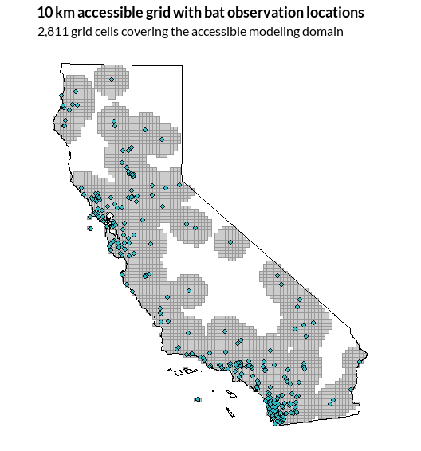
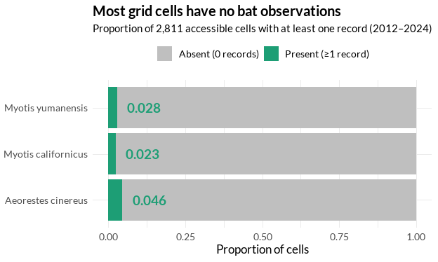
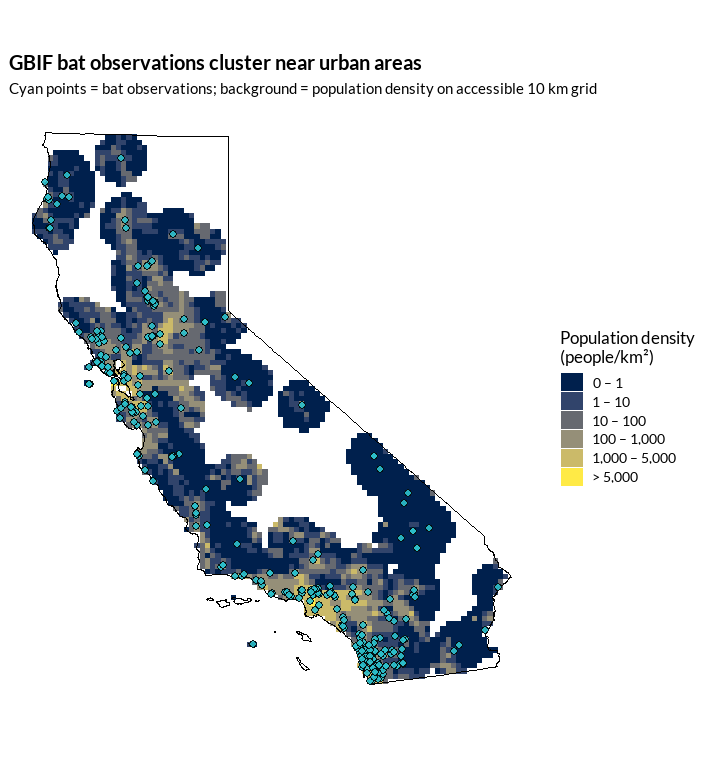
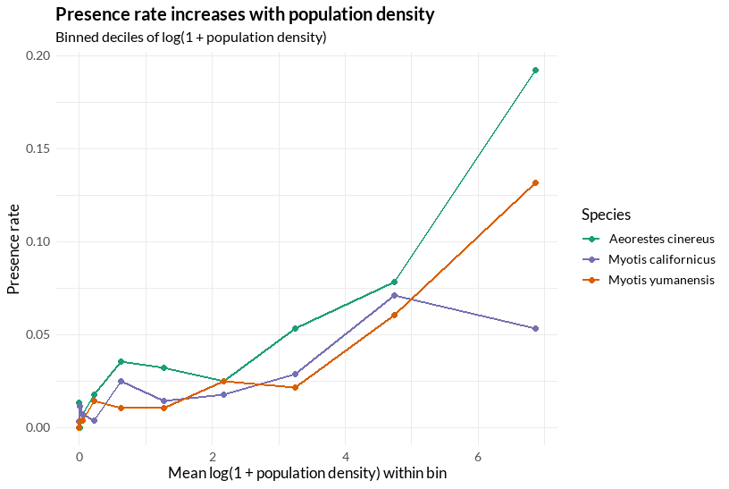
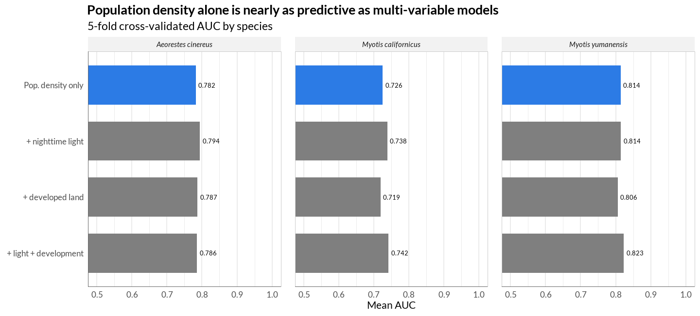
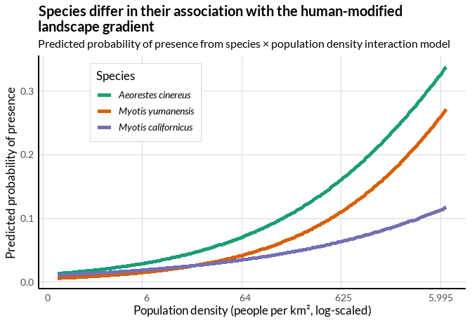

How Do Human-Modified Landscapes Shape Bat Observations in California?
================
Michele Perry
03-26-2026

- [1. Introduction](#1-introduction)
  - [A note on observer bias](#a-note-on-observer-bias)
- [2. Data acquisition and
  processing](#2-data-acquisition-and-processing)
  - [2.1 GBIF bat occurrence data](#21-gbif-bat-occurrence-data)
  - [2.2 California state boundary](#22-california-state-boundary)
  - [2.3 Spatial framework: 10 km equal-area
    grid](#23-spatial-framework-10-km-equal-area-grid)
  - [2.4 Landscape covariates](#24-landscape-covariates)
  - [2.5 Building the final analysis
    dataset](#25-building-the-final-analysis-dataset)
- [3. Exploratory data analysis](#3-exploratory-data-analysis)
  - [3.1 Response structure: extreme
    sparsity](#31-response-structure-extreme-sparsity)
  - [3.2 Mapping observations over the human-modified
    landscape](#32-mapping-observations-over-the-human-modified-landscape)
  - [3.3 Predictor correlations](#33-predictor-correlations)
  - [3.4 Presence rates along the population density
    gradient](#34-presence-rates-along-the-population-density-gradient)
- [4. Modeling bat presence across the urban
  gradient](#4-modeling-bat-presence-across-the-urban-gradient)
  - [4.1 Why logistic regression?](#41-why-logistic-regression)
  - [4.2 Comparing urban predictors](#42-comparing-urban-predictors)
  - [4.3 Do species respond
    differently?](#43-do-species-respond-differently)
  - [4.4 Species-specific effects](#44-species-specific-effects)
  - [4.5 Predicted probability curves](#45-predicted-probability-curves)
- [5. Discussion](#5-discussion)
  - [5.1 Summary of findings](#51-summary-of-findings)
  - [5.2 The dual role of population
    density](#52-the-dual-role-of-population-density)
  - [5.3 Limitations and future
    directions](#53-limitations-and-future-directions)
  - [5.4 So what? Why this matters](#54-so-what-why-this-matters)
- [6. Data sources and citations](#6-data-sources-and-citations)
- [7. Acknowledgements](#7-acknowledgements)
- [8. Related work](#8-related-work)
- [License](#license)

<style type="text/css">
img {
  margin-top: 1.2em;
  margin-bottom: 1.2em;
}
</style>

## 1. Introduction

Urbanization reshapes landscapes at every scale, replacing habitat with
developed land, introducing artificial light, and concentrating human
activity into dense corridors. These changes affect wildlife unevenly:
some species adapt to the urban edge, while others retreat to less
disturbed areas. Identifying which species fall into which category is
important for protecting biodiversity in a rapidly developing world.

Bats are well suited for studying these dynamics. As nocturnal
insectivores, they are directly affected by artificial light, land
development, and the broader footprint of urbanization. California
offers steep urban-to-wildland gradients and a wide variety of bat
species, making it a strong setting for examining how human modification
shapes species distributions.

This project focuses on three bat species that use the landscape in
different ways:

- *Aeorestes cinereus* (hoary bat) — a long-distance migratory,
  tree-roosting species
- *Myotis yumanensis* (Yuma myotis) — a water-associated species often
  found near bridges and buildings
- *Myotis californicus* (California myotis) — a small, crevice-roosting
  species widespread across the state

Because these species have contrasting roosting and foraging ecologies,
they are likely to respond differently to urbanization.

Using publicly available occurrence records from the [Global
Biodiversity Information Facility (GBIF)](https://www.gbif.org/), this
project asks:

> **How do human-modified landscapes structure bat observation patterns
> at fine spatial scales, and do species respond differently to
> increasing urban intensity?**

### A note on observer bias

GBIF records are opportunistic, meaning they reflect where people
looked, not just where bats are. Observations tend to cluster near
roads, cities, and research stations, so any apparent association
between bats and urbanization may partly reflect reporting effort rather
than true ecological preference. This analysis accounts for that bias by
including population density as an accessibility proxy and by
interpreting results as patterns in observed presence rather than
confirmed habitat preference.

## 2. Data acquisition and processing

The data processing pipeline is organized as a series of modular scripts
in the `preprocessing_scripts/` directory (`00_setup.R` through
`06_build_grid_model_dataset.R`). These can be run in order or all at
once using `preprocessing_scripts/run_all.R` to reproduce the full data
cleaning pipeline and final analysis-ready dataset. This section walks
through each stage of the pipeline, covering the key spatial operations
and design decisions.

``` r
#import needed libraries
library(tidyverse)
library(sf)
library(scales)
library(viridis)
library(here)
library(broom)
library(pROC)
library(rsample)
library(purrr)
library(showtext)

font_add_google("Lato", "lato")
showtext_auto()
```

### 2.1 GBIF bat occurrence data

This project uses publicly available species occurrence data from the
[Global Biodiversity Information Facility
(GBIF)](https://www.gbif.org/). GBIF aggregates biodiversity records
from museum collections, citizen science platforms, and research surveys
into a single downloadable format.

The rgbif package allows R to communicate directly with GBIF. The
workflow in `preprocessing_scripts/01_get_clean_bat_points.R` starts by
looking up each species name in the GBIF taxonomy using
`name_backbone()`, which returns a unique numeric identifier
(`species_key`) for each species. This avoids issues where the same
species might be listed under different names.

The download request is submitted via `occ_download()` with filters for
the three focal species keys, valid coordinates, and years 2012–2024:

``` r
# (display only — not executed; see R/01_get_clean_bat_points.R)
dl <- occ_download(
  pred_in("taxonKey", taxa_keys),
  pred("hasCoordinate", TRUE),
  pred_gte("year", 2012),
  pred_lte("year", 2024),
  format = "SIMPLE_CSV"
)
```

GBIF processes this request and returns a zipped CSV containing dozens
of columns. The cleaning step selects only the fields needed for this
analysis and applies coordinate hygiene filters:

``` r
# (display only — not executed; see R/01_get_clean_bat_points.R)
dat <- raw %>%
  transmute(
    gbif_id, species, scientific_name,
    year, month, day,
    lon = decimal_longitude,
    lat = decimal_latitude,
    coordinate_uncertainty_m = coordinate_uncertainty_in_meters
  ) %>%
  filter(
    !is.na(lon), !is.na(lat),        # must have coordinates
    lon != 0, lat != 0,               # exclude zero-island artifacts
    lon >= -125, lon <= -113,          # rough CA bounding box
    lat >= 32, lat <= 42
  )
```

After filtering, the cleaned records are converted to an `sf` spatial
points object in WGS 84 (EPSG:4326) using `st_as_sf()`. All spatial
operations in later scripts build from this file.

### 2.2 California state boundary

A California state boundary polygon is needed for filtering bat points
and building the analysis grid. This is retrieved from the US Census
TIGER/Line database using the `tigris` package (see
`preprocessing_scripts/02_get_ca_boundary.R`).

``` r
ca <- st_read(
  here("data", "processed", "boundaries", "ca_boundary.gpkg"),
  layer = "ca_boundary", quiet = TRUE
)

pts <- st_read(
  here("data", "processed", "gbif", "gbif_bats_points_clean_CA_2012_2024.gpkg"),
  quiet = TRUE
)
```

``` r
cat("Total bat occurrence records in California:", nrow(pts), "\n")
```

    ## Total bat occurrence records in California: 455

``` r
pts %>% st_drop_geometry() %>% count(species, sort = TRUE)
```

    ##               species   n
    ## 1  Aeorestes cinereus 202
    ## 2   Myotis yumanensis 139
    ## 3 Myotis californicus 114

These 455 records are what remain after filtering the raw GBIF download
to valid California coordinates and intersecting with the state boundary
using `st_intersects()` (see
`preprocessing_scripts/03_build_grid_and_domain.R`).

### 2.3 Spatial framework: 10 km equal-area grid

With the bat points and boundary ready, the next step is deciding how to
structure the analysis spatially. Rather than using administrative units
like counties, which vary a lot in size and can span multiple habitat
types, this project uses a regular 10 km equal-area grid. This ensures
every analysis unit covers the same area, making landscape summaries
directly comparable across cells.

All spatial operations use the California Albers projection (EPSG:3310),
an equal-area coordinate system measured in meters. This is important
for any analysis where area calculations matter.

The grid is constructed in
`preprocessing_scripts/03_build_grid_and_domain.R` using
`sf::st_make_grid()`:

``` r
# (display only — not executed; see R/03_build_grid_and_domain.R)
grid_full <- st_make_grid(
  ca_ae,                     # CA boundary in Albers projection
  cellsize = 10000,          # 10 km cells
  square = TRUE
) %>%
  st_as_sf() %>%
  mutate(cell_id = row_number())
```

This produces a grid of regular squares covering the full bounding box
of California. The grid is then trimmed to keep only cells whose
centroids fall inside California. In addition, a “presence rescue” step
retains any cell containing at least one bat observation, even if its
centroid falls just outside the boundary. This prevents losing data
along the coastline and state borders.

**Defining the accessible domain.** Not all of California has been
surveyed for bats, so treating unsampled areas as true absences would be
misleading. To help avoid inflating observer bias even more, the
analysis is restricted to an “accessible” subset of the grid. This
domain is built by buffering every bat observation point by 50 km using
`st_buffer()`, taking the union of those buffers, and intersecting with
a buffered California boundary. Grid cells with centroids inside this
domain, plus any presence-rescued cells, form the final accessible grid:

``` r
grid <- st_read(
  here("data", "processed", "grid", "ca_grid10km_accessible.gpkg"),
  quiet = TRUE
)

cat("Total accessible grid cells:", nrow(grid), "\n")
```

    ## Total accessible grid cells: 2811

``` r
pts_map <- st_transform(pts, st_crs(grid))
ca_map  <- st_transform(ca, st_crs(grid))

ggplot() +
  geom_sf(data = grid, fill = "gray80", color = "gray60", linewidth = 0.2) +
  geom_sf(data = ca_map, fill = NA, color = "black", linewidth = 0.7) +
  geom_sf(data = pts_map, color = "black", fill = "#2CBEC9",
          shape = 21, size = 1.7, stroke = 0.6, alpha = 0.9) +
  coord_sf(datum = NA) +
  labs(
    title = "10 km accessible grid with bat observation locations",
    subtitle = "2,811 grid cells covering the accessible modeling domain"
  ) +
  theme_minimal(base_size = 13, base_family = "lato") +
  theme(
    plot.title = element_text(size = 13.5, face = "bold"),
    plot.subtitle = element_text(size = 12)
  )
```



The grid covers the portions of California where bat observations have
been recorded (plus a 50 km buffer), excluding remote areas like the far
eastern deserts and high Sierra peaks where no records exist. This
represents roughly 75% of the total California grid.

### 2.4 Landscape covariates

Three landscape variables were computed for each grid cell, each drawn
from a different remote sensing or geospatial dataset. The processing
pipeline (`preprocessing_scripts/04_build_grid_covariates.R`) follows a
common pattern for all raster covariates: crop the source raster to the
grid extent, reproject to California Albers (EPSG:3310), and extract a
per-cell summary statistic using `exactextractr::exact_extract()` or
`terra::extract()`.

- **VIIRS nighttime light radiance** — annual composite images of
  nighttime light intensity (nW/cm²/sr) from the Earth Observation Group
  (VNL v2.1 for 2012–2021, v2.2 for 2022–2024). Per-year area-weighted
  means were averaged across all years to produce a single long-term
  mean radiance per cell.
- **NLCD percent developed land** — the National Land Cover Database
  (2019, 30 m resolution) classifies pixels into land cover types. The
  proportion of pixels in the four “Developed” classes (Open Space
  through High Intensity) was computed per cell.
- **GPWv4 population density** — the Gridded Population of the World v4
  (rev. 11, 2020, ~1 km resolution) from NASA SEDAC, summarized per cell
  as an area-weighted mean.

A fourth covariate, percent protected land from PAD-US 4.1 (GAP Status
1–3), was also computed but did not add much predictive value once the
urban variables were included, so it is not used in the final models.
The processing code is still available in
`R/04_build_grid_covariates.R`.

#### Combined covariate dataset

All three urban covariates were joined by `cell_id` into a single table.
Because both radiance and population density span several orders of
magnitude, with most cells near zero and a long tail of high-value urban
cells, log-transformed versions (`log1p_radiance`, `log1p_pop_density`)
were computed to reduce right skew.

``` r
covariates <- read_csv(
  here("data", "processed", "covariates_grid", "grid_covariates_10km.csv"),
  show_col_types = FALSE
)

glimpse(covariates)
```

    ## Rows: 2,811
    ## Columns: 8
    ## $ cell_id           <dbl> 65, 66, 67, 68, 157, 158, 159, 160, 161, 162, 163, 164, 165, 166, 167, 248, 249, …
    ## $ viirs_years       <dbl> 13, 13, 13, 13, 13, 13, 13, 13, 13, 13, 13, 13, 13, 13, 13, 13, 13, 13, 13, 13, 1…
    ## $ mean_radiance     <dbl> 9.7682975622, 21.9013343224, 15.7374121593, 1.0347978748, 27.1875708653, 13.62513…
    ## $ log1p_radiance    <dbl> 2.3766064065, 3.1311951762, 2.8176464629, 0.7103964895, 3.3388811313, 2.682741442…
    ## $ pct_developed     <dbl> 0.35324930280, 0.66167914416, 0.17867701404, 0.00375112986, 0.67366554769, 0.7826…
    ## $ pct_protected     <dbl> 0.078385010836, 0.016632187988, 0.357464284155, 0.454519356915, 0.012856233370, 0…
    ## $ pop_density       <dbl> 2049.4453125, 2088.7136230, 1085.3024902, 52.0659904, 3306.4414062, 2006.9184570,…
    ## $ log1p_pop_density <dbl> 7.6258123, 7.6447823, 6.9905350, 3.9715362, 8.1039302, 7.6048539, 5.3778096, 2.56…

``` r
covariates %>%
  summarise(
    across(c(mean_radiance, pct_developed, pop_density),
           list(Min = ~min(., na.rm = TRUE),
                Median = ~median(., na.rm = TRUE),
                Max = ~max(., na.rm = TRUE)),
           .names = "{.col}__{.fn}")
  ) %>%
  pivot_longer(everything(),
               names_to = c("variable", "stat"),
               names_sep = "__") %>%
  pivot_wider(names_from = stat, values_from = value) %>%
  mutate(variable = recode(variable,
    "mean_radiance" = "Nighttime radiance (nW/cm²/sr)",
    "pct_developed" = "Percent developed land",
    "pop_density"   = "Population density (people/km²)"
  ))
```

    ## # A tibble: 3 × 4
    ##   variable                          Min Median      Max
    ##   <chr>                           <dbl>  <dbl>    <dbl>
    ## 1 Nighttime radiance (nW/cm²/sr)      0 0.0332   77.6  
    ## 2 Percent developed land              0 0.0219    1.000
    ## 3 Population density (people/km²)     0 1.48   6884.

The ranges confirm what we’d expect: most cells have very low radiance,
little developed land, and sparse population, but a small number of
urban cells have extreme values across all three variables.

### 2.5 Building the final analysis dataset

The last step brings together the species presence data and the
landscape covariates into a single analysis-ready dataset.

**Why aggregate across years?** The landscape covariates vary far more
across space than over time at this scale, and 455 total observations
spread across 13 years and three species are too sparse to support
year-level modeling. Aggregating across the full study period
(2012–2024) pools all available data into a single spatial snapshot.
Changes over time are lost, but modeling spatial data becomes easier.
This tradeoff is revisited in the limitations section.

**Presence aggregation.** Each bat point was spatially joined to the
accessible grid (`st_join()` with `st_within()`) and aggregated by cell
and species. `tidyr::complete()` filled in every cell × species
combination with explicit zeros, and a binary `is_present` column was
derived (see `R/05_build_grid_presence.R` and
`R/06_build_grid_model_dataset.R` for details).

**Final merge.** The presence panel was joined to the covariate table by
`cell_id` using a left join, producing one row per cell × species with
both response and predictor variables:

``` r
df <- read_csv(
  here("data", "processed", "analysis_grid", "grid_model_dataset_10km.csv"),
  show_col_types = FALSE
)
```

``` r
glimpse(df)
```

    ## Rows: 8,433
    ## Columns: 11
    ## $ cell_id           <dbl> 1000, 1001, 1002, 1003, 1004, 1005, 1006, 1007, 1070, 1071, 1072, 1073, 1074, 107…
    ## $ species           <chr> "Aeorestes cinereus", "Aeorestes cinereus", "Aeorestes cinereus", "Aeorestes cine…
    ## $ n_obs             <dbl> 0, 0, 0, 0, 0, 0, 0, 0, 0, 0, 1, 0, 0, 0, 0, 0, 0, 0, 0, 0, 0, 0, 0, 0, 0, 0, 0, …
    ## $ is_present        <dbl> 0, 0, 0, 0, 0, 0, 0, 0, 0, 0, 1, 0, 0, 0, 0, 0, 0, 0, 0, 0, 0, 0, 0, 0, 0, 0, 0, …
    ## $ viirs_years       <dbl> 13, 13, 13, 13, 13, 13, 13, 13, 13, 13, 13, 13, 13, 13, 13, 13, 13, 13, 13, 13, 1…
    ## $ mean_radiance     <dbl> 0.000000000, 0.000000000, 0.000000000, 0.000000000, 0.000000000, 0.000000000, 0.0…
    ## $ log1p_radiance    <dbl> 0.000000000, 0.000000000, 0.000000000, 0.000000000, 0.000000000, 0.000000000, 0.0…
    ## $ pct_developed     <dbl> 0.000009000171, 0.000000000000, 0.000000000000, 0.000116996958, 0.000009000252, 0…
    ## $ pct_protected     <dbl> 0.00000000, 0.00000000, 0.48834723, 1.00000000, 1.00000000, 1.00000000, 1.0000000…
    ## $ pop_density       <dbl> 0.02621469460, 0.04218134657, 0.00000000000, 0.00017170282, 0.00820838567, 0.0319…
    ## $ log1p_pop_density <dbl> 0.02587697886, 0.04131596520, 0.00000000000, 0.00017168808, 0.00817488010, 0.0314…

``` r
df %>%
  summarise(
    n_rows = n(),
    n_cells = n_distinct(cell_id),
    n_species = n_distinct(species),
    total_observations = sum(n_obs),
    overall_presence_rate = round(mean(is_present), 4)
  )
```

    ## # A tibble: 1 × 5
    ##   n_rows n_cells n_species total_observations overall_presence_rate
    ##    <int>   <int>     <int>              <dbl>                 <dbl>
    ## 1   8433    2811         3                455                0.0324

The final dataset contains 8,433 rows (2,811 cells × 3 species), each
with three landscape covariates and their log-transformed versions. This
is the dataset used for all exploration and modeling going forward.

## 3. Exploratory data analysis

### 3.1 Response structure: extreme sparsity

``` r
pres_summary <- df %>%
  group_by(species) %>%
  summarise(
    n_cells = n(),
    n_present = sum(is_present),
    prop_present = round(mean(is_present), 3),
    .groups = "drop"
  )

df %>%
  mutate(
    status = if_else(is_present == 1, "Present (\u22651 record)", "Absent (0 records)")
  ) %>%
  count(species, status) %>%
  group_by(species) %>%
  mutate(prop = n / sum(n)) %>%
  ungroup() %>%
  ggplot(aes(x = species, y = prop, fill = status)) +
  geom_col() +
  geom_text(
    data = pres_summary,
    aes(x = species, y = prop_present, label = prop_present),
    inherit.aes = FALSE,
    hjust = -0.3, size = 5, fontface = "bold", color = "#1D9E75"
  ) +
  coord_flip() +
  scale_fill_manual(
    values = c("Present (\u22651 record)" = "#1D9E75",
               "Absent (0 records)" = "gray75")
  ) +
  labs(
    title = "Most grid cells have no bat observations",
    subtitle = "Proportion of 2,811 accessible cells with at least one record (2012\u20132024)",
    x = NULL,
    y = "Proportion of cells",
    fill = NULL
  ) +
  theme_minimal(base_size = 13, base_family = "lato") +
  theme(legend.position = "top",
        plot.title = element_text(size = 15, face = "bold"),
        plot.subtitle = element_text(size = 11))
```



All three species are observed in fewer than 5% of grid cells, with
*Aeorestes cinereus* being the most frequently observed and *Myotis
californicus* the rarest. Because the data are this sparse, it makes
more sense to model binary presence (observed or not) rather than
observation counts. A count-based model would be overwhelmed by
structural zeros.

### 3.2 Mapping observations over the human-modified landscape

``` r
# Join covariates to the spatial grid for mapping
grid_map <- grid %>%
  mutate(cell_id = as.character(cell_id)) %>%
  left_join(
    df %>%
      mutate(cell_id = as.character(cell_id)) %>%
      distinct(cell_id, log1p_pop_density, log1p_radiance, pct_developed),
    by = "cell_id"
  )

# Ensure CRS alignment for all layers
pts_map <- st_transform(pts, st_crs(grid_map))
ca_map  <- st_transform(ca, st_crs(grid_map))
```

``` r
# Define breaks in original units (roughly log-spaced)
pop_breaks <- c(0, 1, 10, 100, 1000, 5000, Inf)
pop_labels <- c("0 – 1", "1 – 10", "10 – 100", "100 – 1,000",
                "1,000 – 5,000", "> 5,000")

# Bin the log-transformed values using the transformed breaks
grid_map <- grid_map %>%
  mutate(
    pop_bin = cut(
      log1p_pop_density,
      breaks = log1p(pop_breaks),
      labels = pop_labels,
      include.lowest = TRUE,
      right = FALSE
    )
  )

# Viridis colors sampled at 6 evenly spaced points
bin_colors <- viridis::viridis(6, option = "cividis")

ggplot() +
  geom_sf(data = grid_map, aes(fill = pop_bin), color = NA) +
  scale_fill_manual(
    values = setNames(bin_colors, pop_labels),
    name = "Population density\n(people/km\u00B2)",
    na.value = "gray90",
    drop = FALSE
  ) +
  geom_sf(data = ca_map, fill = NA, color = "black", linewidth = 0.7) +
  geom_sf(data = pts_map, color = "black", fill = "#2CBEC9",
          shape = 21, size = 2.5, stroke = 0.6, alpha = 0.9) +
  coord_sf(datum = NA) +
  labs(
    title = "GBIF bat observations cluster near urban areas",
    subtitle = "Cyan points = bat observations; background = population density on accessible 10 km grid"
  ) +
  theme_minimal(base_size = 13, base_family = "lato") +
  theme(
    legend.position = "right",
    legend.key.height = unit(0.5, "cm"),
    plot.title = element_text(size = 15, face = "bold"),
    plot.subtitle = element_text(size = 11.5)
  )
```



The map shows a clear pattern: bat observations are concentrated in and
around California’s major population centers, including the San
Francisco Bay Area, Los Angeles basin, San Diego, and Sacramento. Large
parts of the state’s interior, mountains, and deserts have few or no
records. This is the observer bias problem in action. People, and
therefore observation effort, concentrate in cities.

Maps of nighttime light radiance and percent developed land (not shown)
look nearly identical, with the same urban cores lighting up and the
same rural areas staying dark. The correlation analysis below confirms
this visual redundancy.

### 3.3 Predictor correlations

``` r
cov_df <- df %>%
  select(log1p_radiance, log1p_pop_density, pct_developed) %>%
  drop_na()

cor_mat <- round(cor(cov_df), 3)
cor_mat
```

    ##                   log1p_radiance log1p_pop_density pct_developed
    ## log1p_radiance             1.000             0.871         0.936
    ## log1p_pop_density          0.871             1.000         0.807
    ## pct_developed              0.936             0.807         1.000

Nighttime light, population density, and percent developed land are all
strongly correlated (r = 0.81–0.94). At 10 km resolution, these
variables are essentially capturing the same underlying gradient of
human modification. Including all three in a single model would
introduce redundancy without adding predictive value, and the model
comparison in the next section confirms this.

### 3.4 Presence rates along the population density gradient

To explore how bat presence varies with urban intensity, we divide
population density into decile bins (10 equal-sized groups ranked from
lowest to highest density) and compute the share of cells with at least
one observation in each bin, separately by species.

``` r
# Consistent species color palette used throughout
species_colors <- c(
  "Aeorestes cinereus"  = "#1B9E77",
  "Myotis yumanensis"   = "#D95F02",
  "Myotis californicus" = "#7570B3"
)
```

``` r
df %>%
  mutate(bin = ntile(log1p_pop_density, 10)) %>%
  group_by(species, bin) %>%
  summarise(
    x = mean(log1p_pop_density, na.rm = TRUE),
    p = mean(is_present, na.rm = TRUE),
    .groups = "drop"
  ) %>%
  ggplot(aes(x, p, color = species)) +
  geom_line(linewidth = 1) +
  geom_point(size = 2) +
  scale_color_manual(values = species_colors) +
  theme_minimal(base_size = 13, base_family = "lato") +
  theme(
    plot.title = element_text(size = 15, face = "bold"),
    plot.subtitle = element_text(size = 12),
  ) +
  labs(
    title = "Presence rate increases with population density",
    subtitle = "Binned deciles of log(1 + population density)",
    x = "Mean log(1 + population density) within bin",
    y = "Presence rate",
    color = "Species"
  )
```



Presence rates rise sharply in the upper deciles of population density,
and the three species diverge. *Aeorestes cinereus* shows the steepest
increase, while *Myotis californicus* responds more weakly and even dips
around bin 5. Equivalent plots for nighttime radiance and percent
developed land (not shown) show the same general pattern, which is not
surprising given how highly correlated these predictors are. These
exploratory patterns motivate the modeling that follows.

## 4. Modeling bat presence across the urban gradient

### 4.1 Why logistic regression?

The EDA revealed that bat presence is extremely sparse (fewer than 5% of
cells for any species) and that the response of interest is binary: was
a species ever observed in a given grid cell, or not? Logistic
regression is a natural fit for this kind of data. It models the
probability of presence as a function of predictor variables, using a
logit link to keep predicted probabilities between 0 and 1.

In notation, the model has the form:

> log(p / (1 − p)) = β₀ + β₁ · predictor

where *p* is the probability of presence. The coefficient β₁ tells us
how the log-odds of presence change per unit increase in the predictor,
and exp(β₁) gives the odds ratio, the multiplicative change in odds per
unit increase.

All predictors were standardized (z-scored) before modeling so that
coefficients are comparable across variables measured on different
scales.

``` r
# Standardize predictors for comparable coefficients
df_model <- df %>%
  mutate(
    z_radiance  = scale(log1p_radiance)[, 1],
    z_pop       = scale(log1p_pop_density)[, 1],
    z_dev       = scale(pct_developed)[, 1],
    species     = factor(species)
  )
```

### 4.2 Comparing urban predictors

Given the strong collinearity among nighttime light, population density,
and percent developed land, a key question is: **does adding light or
development improve predictions beyond population density alone?**

To answer this, we fit a series of logistic regression models and
compared their predictive performance using 5-fold cross-validated AUC
(area under the receiver operating characteristic (ROC) curve), a
standard metric for binary classification problems. AUC measures how
well a model distinguishes between presence and absence cells, where 0.5
means no better than chance and 1.0 means perfect discrimination. Models
were fit separately for each species.

``` r
# Cross-validation helper: returns mean and SD of AUC across k folds
run_cv_model <- function(data, formula, k = 5) {
  folds <- rsample::vfold_cv(data, v = k, strata = is_present)

  results <- map_df(folds$splits, function(split) {
    train <- rsample::analysis(split)
    test  <- rsample::assessment(split)

    model <- glm(formula, data = train, family = binomial())
    probs <- predict(model, newdata = test, type = "response")
    auc_val <- pROC::auc(test$is_present, probs)

    tibble(auc = as.numeric(auc_val))
  })

  tibble(mean_auc = mean(results$auc), sd_auc = sd(results$auc))
}
```

``` r
model_list <- list(
  S1_pop       = is_present ~ z_pop,
  S2_radiance  = is_present ~ z_radiance,
  S3_dev       = is_present ~ z_dev,
  M1_pop_rad   = is_present ~ z_pop + z_radiance,
  M2_pop_dev   = is_present ~ z_pop + z_dev,
  M4_pop_rad_dev = is_present ~ z_pop + z_radiance + z_dev
)
```

``` r
species_results <- df_model %>%
  group_split(species) %>%
  map_df(function(sp_data) {
    sp_name <- unique(sp_data$species)
    map_df(names(model_list), function(mname) {
      cv_res <- run_cv_model(sp_data, model_list[[mname]])
      tibble(
        species  = sp_name,
        model    = mname,
        mean_auc = cv_res$mean_auc,
        sd_auc   = cv_res$sd_auc
      )
    })
  })
```

``` r
species_results %>%
  filter(model %in% c("S1_pop", "M1_pop_rad", "M2_pop_dev", "M4_pop_rad_dev")) %>%
  mutate(
    model = recode(model,
      "S1_pop"         = "Pop. density only",
      "M1_pop_rad"     = "+ nighttime light",
      "M2_pop_dev"     = "+ developed land",
      "M4_pop_rad_dev" = "+ light + development"
    ),
    model = factor(model, levels = c(
      "+ light + development",
      "+ developed land",
      "+ nighttime light",
      "Pop. density only"
    )),
    highlight = model == "Pop. density only"
  ) %>%
  ggplot(aes(x = mean_auc, y = model, fill = highlight)) +
  geom_col(width = 0.7) +
  geom_text(
    aes(label = sprintf("%.3f", mean_auc)),
    hjust = -0.15, size = 3.5
  ) +
  scale_fill_manual(
    values = c("TRUE" = "#2C7BE5", "FALSE" = "gray50"),
    guide = "none"
  ) +
  facet_wrap(~ species) +
  coord_cartesian(xlim = c(0.5, 1.0)) +
  labs(
    title = "Population density alone is nearly as predictive as multi-variable models",
    subtitle = "5-fold cross-validated AUC by species",
    x = "Mean AUC",
    y = NULL
  ) +
  theme_minimal(base_size = 16, base_family = "lato") +
  theme(
    plot.title = element_text(size = 20, face = "bold"),
    plot.subtitle = element_text(size = 17),
    panel.grid.major.y = element_blank(),
    strip.text = element_text(face = "italic", size = 11),
    axis.line.x = element_line(color = "gray40", linewidth = 0.4),
    axis.line.y = element_line(color = "gray40", linewidth = 0.4),
    panel.spacing = unit(1.5, "lines"),
    panel.border = element_rect(color = "gray80", fill = NA, linewidth = 0.5),
    strip.background = element_rect(fill = "gray95", color = NA)
  )
```



Population density alone achieves cross-validated AUC scores of
approximately 0.73–0.81 depending on species. This means the model can
correctly distinguish presence from absence about 73 to 81 percent of
the time using only population density. Adding nighttime light radiance,
percent developed land, or both improves AUC by less than 1 percentage
point in every case. At 10 km resolution, these variables are
effectively measuring the same underlying gradient of human modification
and are interchangeable as predictors of bat presence.

This does not mean light and development are ecologically irrelevant. It
means that at this spatial scale, with opportunistic data, their effects
cannot be separated from the broader urban intensity signal. For the
rest of the analysis, we use **population density as the single urban
intensity predictor** because it is the simplest, has the clearest dual
interpretation as both an accessibility proxy and a human footprint
measure, and performs as well as any combination of variables.

### 4.3 Do species respond differently?

Population density predicts bat presence, but do all three species
respond to it in the same way? To test this, we fit three nested
logistic models and compared them using AIC (Akaike Information
Criterion,which measures model fit while penalizing added complexity. A
lower AIC indicates a better balance between fit and simplicity.

``` r
# Three nested models: pop only, additive species, species × pop interaction
model_pop         <- glm(is_present ~ z_pop,
                         data = df_model, family = binomial())
model_pop_species <- glm(is_present ~ z_pop + species,
                         data = df_model, family = binomial())
model_interaction <- glm(is_present ~ species * z_pop,
                         data = df_model, family = binomial())
```

``` r
tibble(
  Model = c("Pop. density only",
            "Pop. + species (additive)",
            "Species \u00d7 pop. (interaction)"),
  Description = c(
    "Same slope and intercept for all species",
    "Different intercepts, same slope",
    "Different intercepts and slopes"
  ),
  AIC = c(AIC(model_pop),
          AIC(model_pop_species),
          AIC(model_interaction))
) %>%
  mutate(
    AIC = round(AIC, 1),
    delta_AIC = round(AIC - min(AIC), 1)
  )
```

    ## # A tibble: 3 × 4
    ##   Model                        Description                                AIC delta_AIC
    ##   <chr>                        <chr>                                    <dbl>     <dbl>
    ## 1 Pop. density only            Same slope and intercept for all species 2138.      25.2
    ## 2 Pop. + species (additive)    Different intercepts, same slope         2117.       4.6
    ## 3 Species × pop. (interaction) Different intercepts and slopes          2113.       0

The interaction model provides the best fit (lowest AIC), confirming
that species differ not just in their baseline presence rates but in the
strength of their association with population density. In other words,
the urban gradient does not affect all three species equally.

### 4.4 Species-specific effects

To interpret the interaction model, we extract each species’ slope,
which represents the effect of population density on the log-odds of
presence. We then convert these to odds ratios, which are easier to
interpret: an odds ratio greater than 1 means the odds of presence
increase with population density, while a value less than 1 means they
decrease. The 95% confidence intervals indicate the range of plausible
values for each odds ratio, with narrower intervals reflecting more
precise estimates.

``` r
coefs    <- coef(model_interaction)
vcov_mat <- vcov(model_interaction)

# Helper: extract species-specific slope and standard error
get_species_slope <- function(sp) {
  if (sp == "Aeorestes cinereus") {
    slope <- coefs["z_pop"]
    var   <- vcov_mat["z_pop", "z_pop"]
  } else {
    int_term <- paste0("species", sp, ":z_pop")
    slope <- coefs["z_pop"] + coefs[int_term]
    var   <- vcov_mat["z_pop", "z_pop"] +
             vcov_mat[int_term, int_term] +
             2 * vcov_mat["z_pop", int_term]
  }
  tibble(species = sp, log_odds_slope = slope, se = sqrt(var))
}

or_results <- bind_rows(
  get_species_slope("Aeorestes cinereus"),
  get_species_slope("Myotis californicus"),
  get_species_slope("Myotis yumanensis")
) %>%
  mutate(
    odds_ratio = round(exp(log_odds_slope), 2),
    lower_ci   = round(exp(log_odds_slope - 1.96 * se), 2),
    upper_ci   = round(exp(log_odds_slope + 1.96 * se), 2)
  )
```

``` r
or_results %>%
  transmute(
    Species = species,
    `Odds ratio` = odds_ratio,
    `95% CI` = paste0("(", lower_ci, " – ", upper_ci, ")")
  )
```

    ## # A tibble: 3 × 3
    ##   Species             `Odds ratio` `95% CI`     
    ##   <chr>                      <dbl> <chr>        
    ## 1 Aeorestes cinereus          2.52 (2.16 – 2.95)
    ## 2 Myotis californicus         1.88 (1.53 – 2.3) 
    ## 3 Myotis yumanensis           2.83 (2.31 – 3.47)

All three species show positive associations, but the magnitudes differ:
*Aeorestes cinereus* and *Myotis yumanensis* have the strongest
responses, while *Myotis californicus* shows a notably weaker
association with the urban gradient.

### 4.5 Predicted probability curves

The most interpretable way to visualize the interaction model is to plot
predicted presence probability across the full range of population
density. Because population density was standardized (z-scored) for
modeling, the x-axis is back-transformed here to show real-world units
(people per km²).

``` r
# Back-transformation from z-score to population density
mu  <- mean(df_model$log1p_pop_density)
sig <- sd(df_model$log1p_pop_density)
z_to_pop <- function(z) exp((z * sig) + mu) - 1

# Build prediction grid
pred_grid <- expand.grid(
  z_pop   = seq(min(df_model$z_pop), max(df_model$z_pop), length.out = 200),
  species = levels(df_model$species)
)
pred_grid$pred_prob <- predict(
  model_interaction, newdata = pred_grid, type = "response"
)

# Reorder species for clarity
pred_grid$species <- factor(pred_grid$species, levels = c(
  "Aeorestes cinereus",
  "Myotis yumanensis",
  "Myotis californicus"
))

ggplot(pred_grid, aes(z_pop, pred_prob, color = species)) +
  geom_line(linewidth = 2) +
  scale_color_manual(values = species_colors) +
  scale_x_continuous(
    name = "Population density (people per km\u00B2, log-scaled)",
    labels = function(x) format(round(z_to_pop(x)), big.mark = ",")
  ) +
  labs(
    title = "Species differ in their association with the human-modified \nlandscape gradient",
    subtitle = "Predicted probability of presence from species \u00d7 population density interaction model",
    y = "Predicted probability of presence",
    color = "Species"
  ) +
  theme_minimal(base_size = 13, base_family = "lato") +
  theme(
    plot.title = element_text(size = 15, face = "bold"),
    plot.subtitle = element_text(size = 12),
    axis.line = element_line(linewidth = 0.8, color = "black"),
    panel.grid.major = element_line(linewidth = 0.5, color = "gray85"),
    panel.grid.minor = element_blank(),
    legend.position = c(0.25, 0.80),
    legend.background = element_rect(fill = "white", color = "gray85"),
    legend.text = element_text(face = "italic")
  )
```



This figure is the central result of our analysis. It shows that:

- All three species have higher predicted presence probability in more
  urbanized areas, consistent with observer bias driving the overall
  pattern.
- *Aeorestes cinereus* shows the highest predicted probabilities across
  the gradient, reaching approximately 30% in the most densely populated
  cells.
- *Myotis californicus* shows the weakest response — its predicted
  probability curve rises more slowly and remains lower than the other
  two species even at high population densities.
- The divergence between species is the ecologically interesting signal.
  Even though observer bias inflates all three curves, the *relative
  differences* between species are still informative. They suggest that
  *Myotis californicus* may be more sensitive to urbanization, or at
  least less associated with human-modified landscapes, than the other
  two species.

## 5. Discussion

### 5.1 Summary of findings

This analysis used 455 GBIF bat occurrence records across three focal
species, mapped onto a 10 km equal-area grid covering accessible regions
of California, to examine how components of the human-modified landscape
structure bat observation patterns. Three main findings emerged:

1.  **Population density alone is sufficient to predict bat presence at
    this scale.** Nighttime light radiance and percent developed land
    are strongly correlated with population density at 10 km resolution
    and add very little predictive value (less than 1% AUC improvement).
    At this scale, these variables are essentially measuring the same
    thing.

2.  **All three species show positive associations with increasing urban
    intensity.** This is expected given the opportunistic nature of GBIF
    data. More people means more observers, which means more bat
    records, regardless of true ecological preference.

3.  **Species differ in the strength of their urban association.**
    *Myotis californicus* shows a significantly weaker association with
    population density than either *Aeorestes cinereus* or *Myotis
    yumanensis*. This difference persists even after accounting for the
    shared effect of observer bias, suggesting a genuine ecological
    signal. *Myotis californicus* may be more sensitive to urbanization
    or less tolerant of human-modified landscapes than the other two
    species.

### 5.2 The dual role of population density

Population density serves a dual purpose in this analysis, and the two
are not easy to untangle. First, it serves as an **accessibility
proxy**: areas with more people have more observers, so GBIF records are
naturally biased toward populated areas. Second, it serves as a **human
footprint measure**: population density genuinely correlates with
habitat modification, light pollution, noise, and other stressors that
affect bat ecology.

These roles cannot be fully separated with opportunistic data. The fact
that all three species show positive associations with population
density likely reflects both accessibility bias and genuine urban
tolerance. But the more informative result is the difference between
species. If all three were equally biased by observer effort, their
curves would be parallel. The fact that *Myotis californicus* diverges
from the other two suggests something ecologically real is going on.

### 5.3 Limitations and future directions

- **Observer bias remains the dominant challenge.** Without systematic
  survey data, there is no way to tell whether species are truly more
  common near urban areas or just more frequently reported there.
  Deploying acoustic monitoring arrays across a range of urban and
  wildland areas would be the most direct way to separate real
  ecological preference from reporting effort.

- **Spatial autocorrelation is not modeled.** Nearby grid cells are
  likely more similar to each other than distant ones, violating the
  independence assumption of standard logistic regression. A spatial
  modeling approach like INLA could account for this structure

- **Temporal dynamics are collapsed.** Aggregating bat points across
  2012–2024 and averaging covariates over the same period treats both
  presence and landscape conditions as static, which means any trends
  over time in either species distributions or the covariates themselves
  are hidden. Multi-year monitoring data could reveal whether species
  are actively shifting in response to ongoing urbanization.

- **Sample size is modest.** With only 455 total records, and just 114
  for *Myotis californicus*, there is substantial uncertainty in the
  effect estimates. Incorporating additional data sources like
  iNaturalist or state wildlife agency databases, and expanding to more
  species, would improve statistical power and help test whether the
  urban filtering pattern holds across the broader bat community.

- **Finer spatial resolution** Working at a finer spatial resolution,
  such as 1 km grids, combined with systematic survey data, might make
  it possible to separate nighttime light and land development as
  independent predictors. At 10 km resolution, these variables collapse
  into a single urban gradient, but finer scales could reveal distinct
  effects.

### 5.4 So what? Why this matters

Despite these limitations, this analysis has real implications for how
we think about bats, cities, and the data we use to study them.

**Opportunistic data is valuable, but it’s not the whole picture.** GBIF
records can detect species-level differences in urban association, which
shows that citizen science platforms are genuinely useful for ecological
research. But a species being “present” near a city does not mean it is
thriving there, and large portions of California have no bat records at
all, not because bats are absent, but because no one has looked.
Encouraging survey efforts in under-sampled regions would go a long way
toward separating real ecological patterns from artifacts of observer
effort.

**Cities may be filtering out sensitive species.** The divergence
between species hints at a process of urban filtering, where cities
actively select for species that tolerate or benefit from human
infrastructure while pushing out those that cannot. Some bats find
advantages in urban areas: buildings and bridges provide roost sites,
and artificial lights attract insect prey. But species that depend on
dark forests or natural roost structures receive no such benefit and may
be harmed by light, noise, and fragmentation. The weaker urban
association of *Myotis californicus* is consistent with this process. If
urbanization is quietly reshaping bat communities, that has real
consequences for biodiversity.

**Biodiversity data should inform urban planning.** As California
continues to grow, integrating species vulnerability data into land use
decisions could help identify where development is likely to have the
greatest impact on sensitive species, and where conservation buffers,
wildlife corridors, or dark-sky protections might make a real
difference.

## 6. Data sources and citations

| Dataset | Source | Access |
|----|----|----|
| Bat occurrence records | GBIF (2012–2024) | [gbif.org](https://www.gbif.org/) |
| Nighttime light radiance | VIIRS VNL v2.1/v2.2, EOG Payne Institute | [eogdata.mines.edu](https://eogdata.mines.edu/products/vnl/) |
| Land cover | NLCD 2019 | [mrlc.gov](https://www.mrlc.gov/) |
| Protected areas | PAD-US 4.1 | [usgs.gov/programs/gap-analysis-project](https://www.usgs.gov/programs/gap-analysis-project/science/pad-us-data-download) |
| Population density | GPWv4 rev. 11 (SEDAC/CIESIN) 2020 | [earthdata.nasa.gov](https://www.earthdata.nasa.gov/data/catalog/sedac-ciesin-sedac-gpwv4-popdens-r11-4.11) |
| State boundary | US Census TIGER/Line | via `tigris` R package |

``` r
sessionInfo()
```

    ## R version 4.5.2 (2025-10-31 ucrt)
    ## Platform: x86_64-w64-mingw32/x64
    ## Running under: Windows 11 x64 (build 26200)
    ## 
    ## Matrix products: default
    ##   LAPACK version 3.12.1
    ## 
    ## locale:
    ## [1] LC_COLLATE=English_United States.utf8  LC_CTYPE=English_United States.utf8   
    ## [3] LC_MONETARY=English_United States.utf8 LC_NUMERIC=C                          
    ## [5] LC_TIME=English_United States.utf8    
    ## 
    ## time zone: America/New_York
    ## tzcode source: internal
    ## 
    ## attached base packages:
    ## [1] stats     graphics  grDevices datasets  utils     methods   base     
    ## 
    ## other attached packages:
    ##  [1] showtext_0.9-8    showtextdb_3.0    sysfonts_0.8.9    rsample_1.3.2     pROC_1.19.0.1    
    ##  [6] broom_1.0.11      here_1.0.2        viridis_0.6.5     viridisLite_0.4.2 scales_1.4.0     
    ## [11] sf_1.0-23         lubridate_1.9.4   forcats_1.0.1     stringr_1.6.0     dplyr_1.1.4      
    ## [16] purrr_1.2.0       readr_2.1.6       tidyr_1.3.1       tibble_3.3.0      ggplot2_4.0.1    
    ## [21] tidyverse_2.0.0  
    ## 
    ## loaded via a namespace (and not attached):
    ##  [1] gtable_0.3.6       xfun_0.54          bslib_0.9.0        tzdb_0.5.0         vctrs_0.6.5       
    ##  [6] tools_4.5.2        generics_0.1.4     curl_7.0.0         parallel_4.5.2     proxy_0.4-27      
    ## [11] pkgconfig_2.0.3    KernSmooth_2.23-26 RColorBrewer_1.1-3 S7_0.2.1           lifecycle_1.0.4   
    ## [16] compiler_4.5.2     farver_2.1.2       terra_1.8-86       codetools_0.2-20   htmltools_0.5.9   
    ## [21] class_7.3-23       sass_0.4.10        yaml_2.3.12        crayon_1.5.3       pillar_1.11.1     
    ## [26] furrr_0.3.1        jquerylib_0.1.4    classInt_0.4-11    cachem_1.1.0       parallelly_1.46.1 
    ## [31] tidyselect_1.2.1   digest_0.6.39      stringi_1.8.7      future_1.69.0      listenv_0.10.0    
    ## [36] labeling_0.4.3     rprojroot_2.1.1    fastmap_1.2.0      grid_4.5.2         cli_3.6.5         
    ## [41] magrittr_2.0.4     utf8_1.2.6         e1071_1.7-16       withr_3.0.2        backports_1.5.0   
    ## [46] bit64_4.6.0-1      timechange_0.3.0   rmarkdown_2.30     globals_0.19.0     bit_4.6.0         
    ## [51] gridExtra_2.3      hms_1.1.4          evaluate_1.0.5     knitr_1.50         rlang_1.1.6       
    ## [56] Rcpp_1.1.0         glue_1.8.0         DBI_1.2.3          renv_1.1.5         vroom_1.6.7       
    ## [61] rstudioapi_0.17.1  jsonlite_2.0.0     R6_2.6.1           units_1.0-0

## 7. Acknowledgements

This project was completed as part of the [Yale Environmental Data
Science Certificate
Program](https://environment.yale.edu/certificates/data), 2025–2026
cohort. I am very grateful to the program’s leaders, professors, and
mentors for their guidance and support throughout this program and
project. Capstone projects from the full cohort can be viewed at the
[Cohort 1 Capstones
repository](https://github.com/yse-eds-cert/cohort1-capstones).

## 8. Related work

An interactive R Shiny application for exploring California bat
occurrence patterns and their relationship to landscape variables is
available here: [California Bat Occurrence
Explorer](https://michele-75.shinyapps.io/california-bat-occurrence-explorer/).

## License

This project was created for educational purposes as part of a graduate
certificate program. All code and original text are provided as-is for
learning and reference. Data used in this analysis are publicly
available from the sources cited above and are subject to their
respective terms of use. GBIF-mediated occurrence data should be cited
according to [GBIF citation
guidelines](https://www.gbif.org/citation-guidelines).
